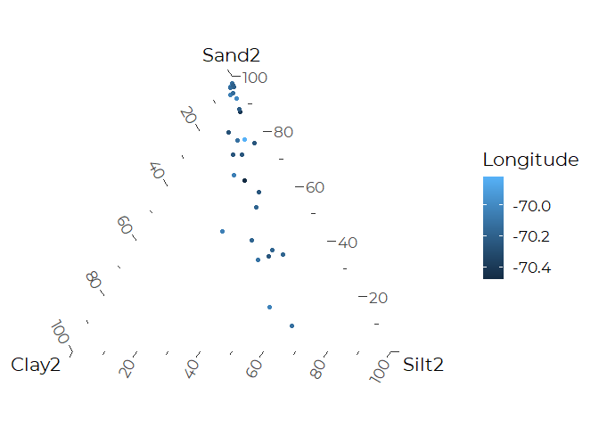
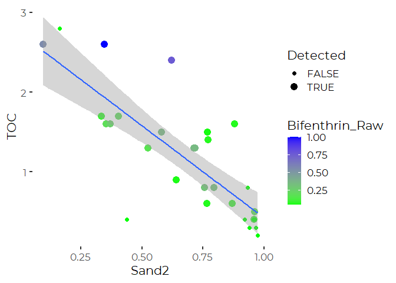
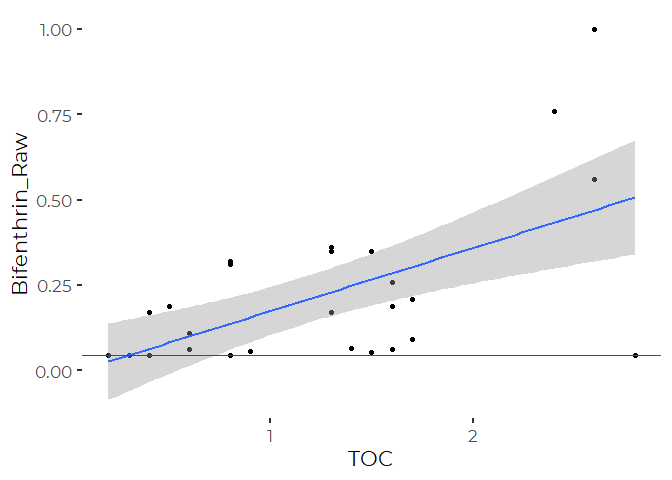
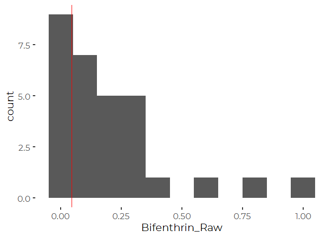
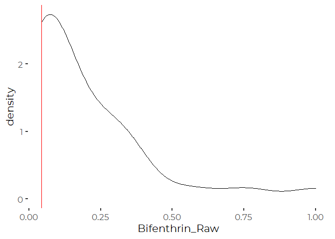
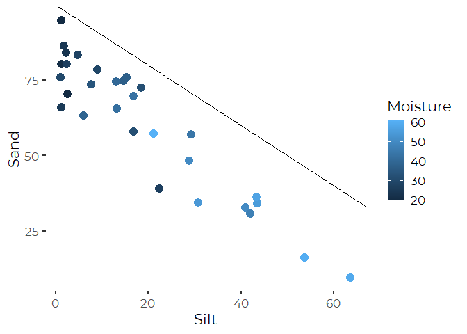

Analysis of Bifenthrin Concentrations from BPC 2015 and 2014 Sediment
Data
================
Curtis C. Bohlen, Casco Bay Estuary Partnership
Updated Jan 13, 2022

-   [Load Data](#load-data)
    -   [Establish Folder References](#establish-folder-references)
-   [Add Location Data](#add-location-data)
-   [Sediment Composition](#sediment-composition)
    -   [Ternary Diagram](#ternary-diagram)
    -   [Correlations](#correlations)
-   [Histograms](#histograms)
-   [Moisture is Correlated with
    Textrures](#moisture-is-correlated-with-textrures)


\#Libraries

``` r
library(tidyverse)
```

    ## -- Attaching packages --------------------------------------- tidyverse 1.3.1 --

    ## v ggplot2 3.3.5     v purrr   0.3.4
    ## v tibble  3.1.6     v dplyr   1.0.7
    ## v tidyr   1.1.4     v stringr 1.4.0
    ## v readr   2.1.1     v forcats 0.5.1

    ## -- Conflicts ------------------------------------------ tidyverse_conflicts() --
    ## x dplyr::filter() masks stats::filter()
    ## x dplyr::lag()    masks stats::lag()

``` r
library(magrittr)
```

    ## 
    ## Attaching package: 'magrittr'

    ## The following object is masked from 'package:purrr':
    ## 
    ##     set_names

    ## The following object is masked from 'package:tidyr':
    ## 
    ##     extract

``` r
library(readxl)
library(ggtern)   # For Ternary Diagram in GGPLOT graphics
```

    ## Registered S3 methods overwritten by 'ggtern':
    ##   method           from   
    ##   grid.draw.ggplot ggplot2
    ##   plot.ggplot      ggplot2
    ##   print.ggplot     ggplot2

    ## --
    ## Remember to cite, run citation(package = 'ggtern') for further info.
    ## --

    ## 
    ## Attaching package: 'ggtern'

    ## The following objects are masked from 'package:ggplot2':
    ## 
    ##     aes, annotate, ggplot, ggplot_build, ggplot_gtable, ggplotGrob,
    ##     ggsave, layer_data, theme_bw, theme_classic, theme_dark,
    ##     theme_gray, theme_light, theme_linedraw, theme_minimal, theme_void

``` r
library(CBEPgraphics)
load_cbep_fonts()
theme_set(theme_cbep())
```

# Load Data

## Establish Folder References

``` r
sibfldnm <- 'Data'
parent   <- dirname(getwd())
sibling  <- file.path(parent,sibfldnm)
fn <- "BPC_2014_2015_Sediment_Data.txt"

# dir.create(file.path(getwd(), 'figures'), showWarnings = FALSE)
```

We need to address slightly different Yarmouth sampling locations, and
sample locations that include dates from Yarmouth and South Portland.

``` r
the_data <- read.delim(file.path(sibling, fn), skip = 1, sep = '\t') %>%
  select(2:15) %>%
  rename(Town = Location_Descr) %>%
  mutate(Town = if_else(grepl("Yarmouth", Town), "Yarmouth", Town)) %>%
  mutate(Town = if_else(Town =="Yarmouth" & Year == 2014, 
                        "Yarmouth_2014", Town)) %>%
  mutate(Town = if_else(Town =="Yarmouth" & Year == 2015,
                        "Yarmouth_2015", Town)) %>%
  mutate(Town = if_else(grepl("S. Portland", Town), "S. Portland", Town)) %>%
  mutate(Town = plyr::revalue(Town, c("Kettle Cove (Cape Elizabeth)"    = "Kettle Cove",
                  "Falmouth-Foreside (duplicate)"   = "Falmouth-Foreside",
                  "Little Flying Point (replicate)" = "Little Flying Point",
                  "Lookout Point (Harpswell Center)" = "Lookout Point")))

summary(the_data)
```

    ##      Town               Date                Year          Coarse      
    ##  Length:30          Length:30          Min.   :2014   Min.   : 0.200  
    ##  Class :character   Class :character   1st Qu.:2014   1st Qu.: 2.125  
    ##  Mode  :character   Mode  :character   Median :2015   Median : 8.350  
    ##                                        Mean   :2015   Mean   : 9.417  
    ##                                        3rd Qu.:2015   3rd Qu.:13.875  
    ##                                        Max.   :2015   Max.   :31.200  
    ##                                                                       
    ##       Sand            Silt             Clay            TOC       
    ##  Min.   : 9.40   Min.   : 1.100   Min.   : 1.10   Min.   :0.200  
    ##  1st Qu.:41.30   1st Qu.: 3.175   1st Qu.: 2.40   1st Qu.:0.425  
    ##  Median :67.75   Median :15.100   Median :10.35   Median :1.100  
    ##  Mean   :60.76   Mean   :18.990   Mean   :10.84   Mean   :1.157  
    ##  3rd Qu.:75.80   3rd Qu.:29.100   3rd Qu.:15.65   3rd Qu.:1.600  
    ##  Max.   :94.90   Max.   :63.600   Max.   :29.90   Max.   :2.800  
    ##                                                                  
    ##     Moisture     Bifenthrin_Raw   Bifenthrin_ND   Bifenthrin_OC  
    ##  Min.   :20.00   Min.   :0.0450   Mode :logical   Min.   : 1.60  
    ##  1st Qu.:27.25   1st Qu.:0.0450   FALSE:21        1st Qu.:14.75  
    ##  Median :37.00   Median :0.1005   TRUE :9         Median :24.40  
    ##  Mean   :38.23   Mean   :0.2037                   Mean   :30.87  
    ##  3rd Qu.:49.25   3rd Qu.:0.2975                   3rd Qu.:48.80  
    ##  Max.   :61.00   Max.   :1.0000                   Max.   :85.40  
    ##                                                                  
    ##      BTU_H          BTU_E        
    ##  Min.   :0.01   Min.   :0.01000  
    ##  1st Qu.:0.03   1st Qu.:0.02000  
    ##  Median :0.07   Median :0.04000  
    ##  Mean   :0.07   Mean   :0.03714  
    ##  3rd Qu.:0.10   3rd Qu.:0.05000  
    ##  Max.   :0.16   Max.   :0.08000  
    ##  NA's   :9      NA's   :9

# Add Location Data

``` r
fn <- 'BPC_2014_sediment_Locations.txt'
locs_2014 <- read.delim(file.path(sibling, fn), sep = '\t') %>%
  mutate(Town = if_else(Town == "Yarmouth", "Yarmouth_2014", Town))
         
fn <- 'BPC_2015_sediment_Locations.txt'
locs_2015 <- read.delim(file.path(sibling, fn), sep = '\t') %>%
  mutate(Town = if_else(Town == "Yarmouth", "Yarmouth_2015", Town)) %>%
  mutate(Town = if_else(Town == "Biddeford", "Biddeford (Saco R)", Town)) %>%
  mutate(Town = if_else(Town == "Winslow", "Winslow Park", Town))

locs <- bind_rows(locs_2014, locs_2015) %>%
  select(Town, Latitude, Longitude) %>%
  unique() %>%
  arrange(Town)
```

``` r
the_data <- the_data %>%
  left_join(locs, by = "Town")
```

# Sediment Composition

We recast sand, silt, and clay fractions to ignore Coarse" particles, so
we can look at them in a classic Ternary Diagram.

``` r
the_data <- the_data %>%
  mutate(Sand2 = Sand / (Sand + Silt + Clay),
         Silt2 = Silt / (Sand + Silt + Clay),
         Clay2 = Clay / (Sand + Silt + Clay))
```

## Ternary Diagram

``` r
plt <- the_data %>%
  ggtern(aes(Clay2, Sand2, Silt2)) + geom_point((aes(color = Longitude)))
plt
```

<!-- -->

You can see that the sediments range from sands to sandy muds. Sand
content varies from about 10% to about 100%. Clay is never above about
30%.

Sand had the highest variation, so conditioning other variables on
percent sand probably makes the most sense.

## Correlations

Clay and Silt are highly correlated.

``` r
the_data %$% cor(Sand2, Clay2)
```

    ## [1] -0.9378018

``` r
the_data %$% cor(Sand2, Silt2)
```

    ## [1] -0.9836945

``` r
the_data %$% cor(Silt2, Clay2)
```

    ## [1] 0.8600726

As expected, organic matter is correlated with proportion of fines,
especially silt and negatively correlated with sands) . The negative
correlations is slightly less strong when you include the Coarse
Particles in calculation of percent sands.

``` r
the_data %$% cor(Sand, TOC)
```

    ## [1] -0.7694861

``` r
the_data %$% cor(Sand2, TOC)
```

    ## [1] -0.8018222

``` r
the_data %$% cor(Silt2, TOC) 
```

    ## [1] 0.8260117

``` r
plt <- ggplot(the_data) + aes(Sand2, TOC) + 
  geom_point(aes(color = Bifenthrin_Raw, size =  ! Bifenthrin_ND)) + 
  geom_smooth(method = 'lm') +
  scale_color_gradient(low = 'green1', high = 'blue') +
  scale_size_discrete(range = c(2,4),name = 'Detected')
```

    ## Warning: Using size for a discrete variable is not advised.

``` r
plt
```

    ## `geom_smooth()` using formula 'y ~ x'

<!-- -->

Bifenthrin clearly shows a pattern with TOC. But it does NOT look like
there’s a strong connection with soil texture per se.

\#Bifenthrin Levels

``` r
the_data %$% cor(Sand, Bifenthrin_Raw, use = 'pairwise')
```

    ## [1] -0.3588509

``` r
the_data %$% cor(TOC, Bifenthrin_Raw, use = 'pairwise')
```

    ## [1] 0.611962

``` r
the_data %$% cor(Clay, Bifenthrin_Raw, use = 'pairwise') 
```

    ## [1] 0.3486164

But that treated all NDs as sitting at teh detection limit.

``` r
plt <- ggplot(the_data, aes(TOC, Bifenthrin_Raw)) + 
  geom_point() +
  geom_smooth(method = 'lm') + 
  geom_hline(yintercept = 0.045, color = 'red') # The detection limit
plt
```

    ## `geom_smooth()` using formula 'y ~ x'

<!-- -->

# Histograms

``` r
plt <- ggplot(the_data, aes(Bifenthrin_Raw)) + 
  geom_histogram(binwidth = .10) + 
  geom_vline(xintercept = 0.045, color = 'red')
plt
```

<!-- -->

``` r
plt <- ggplot(the_data, aes(Bifenthrin_Raw)) + 
  geom_density() + 
  geom_vline(xintercept = 0.045, color = 'red')
plt
```

<!-- -->
One could almost consider that a truncated normal distribution.

# Moisture is Correlated with Textrures

``` r
plt <- ggplot(the_data, aes(Silt, Sand)) + 
  geom_point(aes( color = Moisture), size =4) + 
  geom_abline(intercept = 100, slope = -1)
plt
```

<!-- -->
