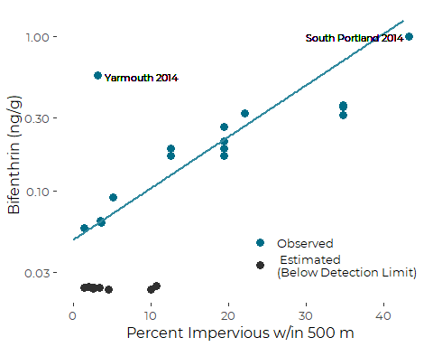
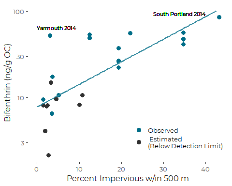

Bifenthrin Regression Models
================
Curtis C. Bohlen, Casco Bay Estuary Partnership.
Updated January 13, 2022

-   [Introduction](#introduction)
-   [Load Libraries](#load-libraries)
-   [Load Data](#load-data)
    -   [Folder References](#folder-references)
    -   [Load IC Data](#load-ic-data)
    -   [Load Pyrethroid Concentration
        Data](#load-pyrethroid-concentration-data)
-   [Import IC metrics into
    conc\_data](#import-ic-metrics-into-conc_data)
    -   [Log-linear Model](#log-linear-model)
    -   [Robust Regression](#robust-regression)
    -   [Theil-Sen Resistent
        Regression](#theil-sen-resistent-regression)
        -   [Showing the Resistant
            Regression](#showing-the-resistant-regression)
-   [Concentrations on an Organic Carbon
    Basis](#concentrations-on-an-organic-carbon-basis)
    -   [Log-Linear Model](#log-linear-model-1)
    -   [Robust Regresison](#robust-regresison)
    -   [Theil-Sel (Seigal) Estimator](#theil-sel-seigal-estimator)
        -   [Showing the Resistant
            Regression](#showing-the-resistant-regression-1)


# Introduction

In 2014 and 2015, the Maine Board of Pesticides Control collected
sediment samples from the Coast of Maine and Casco Bay, and analyzed
them for presence of selected pesticides, especially certain pyrethroid
pesticides.

The only pyrethroid that was observed consistently was bifenthrin,
probably because bifenthrin could be detected in sediment samples at
substantially lower concentrations than the other pyrethroid pesticides
on the testing panel.

We focus our analysis on bifenthrin. Our principal goal is to produce a
MAP of average bifenthrin concentrations and a FIGURE showing the
relationship between bifenthrin concentration and extent of nearby
impervious surfaces (as a rough measure of urbanization).

# Load Libraries

``` r
library(tidyverse)
#> -- Attaching packages --------------------------------------- tidyverse 1.3.1 --
#> v ggplot2 3.3.5     v purrr   0.3.4
#> v tibble  3.1.6     v dplyr   1.0.7
#> v tidyr   1.1.4     v stringr 1.4.0
#> v readr   2.1.1     v forcats 0.5.1
#> -- Conflicts ------------------------------------------ tidyverse_conflicts() --
#> x dplyr::filter() masks stats::filter()
#> x dplyr::lag()    masks stats::lag()
library(mblm)
library(robustbase)  # could also use robust, or several others....
library(CBEPgraphics)
load_cbep_fonts()
theme_set(theme_cbep())

library(LCensMeans)
```

# Load Data

## Folder References

``` r
sibfldnm <- 'Data'
parent   <- dirname(getwd())
sibling  <- file.path(parent,sibfldnm)

#dir.create(file.path(getwd(), 'figures'), showWarnings = FALSE)

conc_fn <- 'BPC_2014_2015_Sediment_Data.txt'
geogr_fn <- 'imperviousness.txt'
```

## Load IC Data

``` r
ic_data <- read.delim(file.path(sibling, geogr_fn), sep = ',') %>%
  select(-OBJECTID, -Latitude, -Longitude) %>%
  rename(yr = 'Year_') %>%
  mutate(pctI500 = imperv500 / (pi*500^2),
         pctI1000 = imperv1000 / (pi*1000^2),
         pctI2000 = imperv2000 / (pi*2000^2)) %>%
  filter(Location != 8)       # Remove Bothbay Location
```

## Load Pyrethroid Concentration Data

``` r
conc_data <- read.delim(file.path(sibling, conc_fn), skip = 1) %>%
  select(1:15)
```

# Import IC metrics into conc\_data

We calculate estimated organic-carbon weighted concentrations AFTER
calculating maximum likelihood estimates of dry weight. Detection limits
for the relevant methods apply to dry weight concentrations, so that is
the appropriate place to calculate the ML estimators.

``` r
ml_estimator_Raw <- sub_cmeans(conc_data$Bifenthrin_Raw,
                                               conc_data$Bifenthrin_ND)
conc_data <- conc_data %>%
  mutate(pct500   = ic_data$pctI500[match(LocCode, ic_data$Location)],
         pct1000  = ic_data$pctI1000[match(LocCode, ic_data$Location)],
         pct2000  = ic_data$pctI2000[match(LocCode, ic_data$Location)]) %>%
  mutate(Bifenthrin_ML = ml_estimator_Raw,     # Raw observation (dry weight)
         Bifenthrin_OC_QML = Bifenthrin_ML * 100* (100/(100-Moisture)) / TOC) %>%
  mutate(across(starts_with('pct'), ~ round(.x * 100, 1)))
```

## Log-linear Model

Although we have previously noted correlations with moisture and sand in
the sediment samples, we don’t see either of those turning up as
significant in a model that includes imperviousness.

``` r
the_lm <- lm(log10(Bifenthrin_ML)~pct500 * Sand * Moisture, data = conc_data)
step_lm <- step(the_lm)
#> Start:  AIC=-54.13
#> log10(Bifenthrin_ML) ~ pct500 * Sand * Moisture
#> 
#>                        Df Sum of Sq    RSS     AIC
#> - pct500:Sand:Moisture  1   0.11426 1.8664 -54.486
#> <none>                              1.7522 -54.129
#> 
#> Step:  AIC=-54.49
#> log10(Bifenthrin_ML) ~ pct500 + Sand + Moisture + pct500:Sand + 
#>     pct500:Moisture + Sand:Moisture
#> 
#>                   Df Sum of Sq    RSS     AIC
#> - pct500:Sand      1  0.020552 1.8870 -56.201
#> - Sand:Moisture    1  0.028034 1.8944 -56.098
#> - pct500:Moisture  1  0.078445 1.9449 -55.416
#> <none>                         1.8664 -54.486
#> 
#> Step:  AIC=-56.2
#> log10(Bifenthrin_ML) ~ pct500 + Sand + Moisture + pct500:Moisture + 
#>     Sand:Moisture
#> 
#>                   Df Sum of Sq    RSS     AIC
#> - Sand:Moisture    1  0.051955 1.9389 -57.495
#> - pct500:Moisture  1  0.115785 2.0027 -56.653
#> <none>                         1.8870 -56.201
#> 
#> Step:  AIC=-57.5
#> log10(Bifenthrin_ML) ~ pct500 + Sand + Moisture + pct500:Moisture
#> 
#>                   Df Sum of Sq    RSS     AIC
#> - Sand             1  0.048473 1.9874 -58.853
#> - pct500:Moisture  1  0.142048 2.0810 -57.657
#> <none>                         1.9389 -57.495
#> 
#> Step:  AIC=-58.85
#> log10(Bifenthrin_ML) ~ pct500 + Moisture + pct500:Moisture
#> 
#>                   Df Sum of Sq    RSS     AIC
#> - pct500:Moisture  1   0.12836 2.1158 -59.226
#> <none>                         1.9874 -58.853
#> 
#> Step:  AIC=-59.23
#> log10(Bifenthrin_ML) ~ pct500 + Moisture
#> 
#>            Df Sum of Sq    RSS     AIC
#> <none>                  2.1158 -59.226
#> - Moisture  1   0.63261 2.7484 -54.424
#> - pct500    1   2.97873 5.0945 -38.378
summary(step_lm)
#> 
#> Call:
#> lm(formula = log10(Bifenthrin_ML) ~ pct500 + Moisture, data = conc_data)
#> 
#> Residuals:
#>      Min       1Q   Median       3Q      Max 
#> -0.58517 -0.13231 -0.05323  0.06184  0.78518 
#> 
#> Coefficients:
#>              Estimate Std. Error t value Pr(>|t|)    
#> (Intercept) -1.874682   0.182887 -10.251 4.78e-10 ***
#> pct500       0.027951   0.004912   5.690 8.56e-06 ***
#> Moisture     0.012729   0.004854   2.622   0.0152 *  
#> ---
#> Signif. codes:  0 '***' 0.001 '**' 0.01 '*' 0.05 '.' 0.1 ' ' 1
#> 
#> Residual standard error: 0.3033 on 23 degrees of freedom
#>   (4 observations deleted due to missingness)
#> Multiple R-squared:  0.7041, Adjusted R-squared:  0.6783 
#> F-statistic: 27.36 on 2 and 23 DF,  p-value: 8.298e-07
```

So moisture is meaningful predictor, but it is colinear with sand,
confounding a simple linear model. The interaction is not significant.
It is interesting that the coefficient with moisture in POSITIVE,
meaning sediments containing more moisture tend to hold more bifenthrin.

## Robust Regression

Because of the non-detects and possible outliers. we do not trust the
linear model al lthat much, so we compare results briefly with a robust
linear model based on M estimators. (M estimators downweight “outliers”
in a systematic way, making the regression less sensitive to data that
falls far away from the regression line).

Limited exploration of other model structures suggest sand is sometimes
a valuable predictor in a robust model setting when interactions between
Sand and Moisture are included. But that complicates interpretation, for
little explanatory gain. We stick with models without interaction terms.

``` r
the_lmrob <- lmrob(log10(Bifenthrin_ML)~pct500 + Sand + Moisture, data = conc_data)
summary(the_lmrob)
#> 
#> Call:
#> lmrob(formula = log10(Bifenthrin_ML) ~ pct500 + Sand + Moisture, data = conc_data)
#>  \--> method = "MM"
#> Residuals:
#>       Min        1Q    Median        3Q       Max 
#> -0.696658 -0.044731 -0.002399  0.115149  0.676446 
#> 
#> Coefficients:
#>               Estimate Std. Error t value Pr(>|t|)    
#> (Intercept) -2.0826707  0.2169532  -9.600 2.53e-09 ***
#> pct500       0.0255481  0.0026096   9.790 1.77e-09 ***
#> Sand        -0.0005581  0.0015158  -0.368 0.716276    
#> Moisture     0.0183129  0.0042618   4.297 0.000292 ***
#> ---
#> Signif. codes:  0 '***' 0.001 '**' 0.01 '*' 0.05 '.' 0.1 ' ' 1
#> 
#> Robust residual standard error: 0.147 
#>   (4 observations deleted due to missingness)
#> Multiple R-squared:  0.9436, Adjusted R-squared:  0.9359 
#> Convergence in 12 IRWLS iterations
#> 
#> Robustness weights: 
#>  3 observations c(3,5,11) are outliers with |weight| <= 0.0036 ( < 0.0038); 
#>  4 weights are ~= 1. The remaining 19 ones are summarized as
#>     Min.  1st Qu.   Median     Mean  3rd Qu.     Max. 
#> 0.009613 0.880500 0.978700 0.846300 0.995000 0.998300 
#> Algorithmic parameters: 
#>        tuning.chi                bb        tuning.psi        refine.tol 
#>         1.548e+00         5.000e-01         4.685e+00         1.000e-07 
#>           rel.tol         scale.tol         solve.tol       eps.outlier 
#>         1.000e-07         1.000e-10         1.000e-07         3.846e-03 
#>             eps.x warn.limit.reject warn.limit.meanrw 
#>         1.726e-10         5.000e-01         5.000e-01 
#>      nResample         max.it       best.r.s       k.fast.s          k.max 
#>            500             50              2              1            200 
#>    maxit.scale      trace.lev            mts     compute.rd fast.s.large.n 
#>            200              0           1000              0           2000 
#>                   psi           subsampling                   cov 
#>            "bisquare"         "nonsingular"         ".vcov.avar1" 
#> compute.outlier.stats 
#>                  "SM" 
#> seed : int(0)
```

So, in a robust setting, moisture remains an effective predictor, and
the model does a considerably better job of predicting the data.

In practice, however, we want to show the relationship between
impervious surfaces and bifenthrin. We can show that most

## Theil-Sen Resistent Regression

We use a simpler resistant regression estimator, known as the Theil-Sen
estimator (Actually a modification due to Seigal), implemented (*inter
alia*) as `mblm()` in the mblm package. This regression method can only
handle a single predictor, which in this case if the degree of nearby
imperviousness.

Statistical significance for these tests can be a bit finicky in the
case of tied values, which we have here, so we resort to testing
significance of the closely related Kendall’s Tau correlation
coefficient. In a more careful analysis, we might try permutation tests,
or a bootstrap, but in this case, the results are highly significant by
any test, so there is little point in being more precise.

Unfortunately, the mblm package does not handle missing values or data
transformations all that well, so we need to clean things up a bit.

``` r
tmp <- conc_data %>%
  filter(! is.na(pct500)) %>%
  select(pct500, Bifenthrin_ND, Bifenthrin_ML, Bifenthrin_OC_QML, Sand, Moisture) %>%
  mutate(log_bifenthrin  = log(Bifenthrin_ML),
         log_bifenthrin_oc = log(Bifenthrin_OC_QML))
```

``` r
the_mblm <- mblm(log_bifenthrin~pct500, data = tmp)
summary(the_mblm)
#> Warning in wilcox.test.default(z$intercepts): cannot compute exact p-value with
#> ties
#> Warning in wilcox.test.default(z$slopes): cannot compute exact p-value with ties
#> Warning in wilcox.test.default(z$intercepts): cannot compute exact p-value with
#> ties
#> Warning in wilcox.test.default(z$slopes): cannot compute exact p-value with ties
#> 
#> Call:
#> mblm(formula = log_bifenthrin ~ pct500, dataframe = tmp)
#> 
#> Residuals:
#>      Min       1Q   Median       3Q      Max 
#> -1.51677 -0.88725 -0.47546  0.05018  2.20302 
#> 
#> Coefficients:
#>             Estimate      MAD V value Pr(>|V|)    
#> (Intercept) -3.02041  0.15766       0 8.79e-06 ***
#> pct500       0.07664  0.01373     350 9.89e-06 ***
#> ---
#> Signif. codes:  0 '***' 0.001 '**' 0.01 '*' 0.05 '.' 0.1 ' ' 1
#> 
#> Residual standard error: 0.8676 on 24 degrees of freedom
cor.test(tmp$pct500,tmp$log_bifenthrin, method = 'kendall')
#> Warning in cor.test.default(tmp$pct500, tmp$log_bifenthrin, method = "kendall"):
#> Cannot compute exact p-value with ties
#> 
#>  Kendall's rank correlation tau
#> 
#> data:  tmp$pct500 and tmp$log_bifenthrin
#> z = 4.2772, p-value = 1.893e-05
#> alternative hypothesis: true tau is not equal to 0
#> sample estimates:
#>       tau 
#> 0.6098867
```

We create a dataframe to pass to ggplot to generate the regression line
in our plot.

``` r
coefs <- coef(the_mblm)
theline <- tibble(x = seq(0,42.5, .25),
                  y = exp(coefs[[1]] + coefs[[2]]*seq(0,42.5, .25)))
```

### Showing the Resistant Regression

``` r
plt <- ggplot(tmp, aes(pct500, Bifenthrin_ML)) +
  geom_point(aes(color = Bifenthrin_ND), size = 3) +
  geom_line(data = theline, aes(x,y),
            color = cbep_colors()[5],
            lwd = 1) +
  geom_text(aes(x=4, y=0.55, label = 'Yarmouth 2014'),
            hjust = 0, size = 3) +
  geom_text(aes(x=42.5, y=0.99, label = 'South Portland 2014'),
            hjust = 1, size = 3) +
  
  theme_cbep(base_size = 12) +
  theme(legend.position=c(0.75, 0.2)) +
  
  scale_color_manual(values = cbep_colors()[c(1,3)], name = '',
                     labels = c('Observed', ' Estimated\n(Below Detection Limit)')) +
  scale_y_log10() +
  
  ylab('Bifenthrin (ng/g)') +
  xlab('Percent Impervious w/in 500 m')
plt
```



# Concentrations on an Organic Carbon Basis

Toxicity of organic contaminants in sediment are often more highly
correlated concentrations as a fraction of the organic carbon in the
sample, rather than the mass fraction in the entire sample. Maine BEP
toxicologist, Pam Breyer, used OC-based concentrations to evaluate
whether levels of bifenthrin approached levels of concern, and concluded
that they did not.

In our context, looking at spatial patterns, rather than toxicity, it is
not obvious which concentration basis makes better sense. Here we
produce the OC-based graphic, for completeness, although we are unlikely
to use it in the Report.

## Log-Linear Model

``` r
the_lm <- lm(log10(Bifenthrin_OC)~pct500 * Sand * Moisture, data = conc_data)
step_lm <- step(the_lm)
#> Start:  AIC=-58.34
#> log10(Bifenthrin_OC) ~ pct500 * Sand * Moisture
#> 
#>                        Df Sum of Sq    RSS     AIC
#> - pct500:Sand:Moisture  1  0.058285 1.5487 -59.338
#> <none>                              1.4904 -58.335
#> 
#> Step:  AIC=-59.34
#> log10(Bifenthrin_OC) ~ pct500 + Sand + Moisture + pct500:Sand + 
#>     pct500:Moisture + Sand:Moisture
#> 
#>                   Df Sum of Sq    RSS     AIC
#> - pct500:Sand      1  0.000027 1.5487 -61.337
#> - pct500:Moisture  1  0.002620 1.5513 -61.294
#> <none>                         1.5487 -59.338
#> - Sand:Moisture    1  0.200741 1.7494 -58.169
#> 
#> Step:  AIC=-61.34
#> log10(Bifenthrin_OC) ~ pct500 + Sand + Moisture + pct500:Moisture + 
#>     Sand:Moisture
#> 
#>                   Df Sum of Sq    RSS     AIC
#> - pct500:Moisture  1  0.010881 1.5596 -63.155
#> <none>                         1.5487 -61.337
#> - Sand:Moisture    1  0.223856 1.7726 -59.827
#> 
#> Step:  AIC=-63.16
#> log10(Bifenthrin_OC) ~ pct500 + Sand + Moisture + Sand:Moisture
#> 
#>                 Df Sum of Sq    RSS     AIC
#> <none>                       1.5596 -63.155
#> - Sand:Moisture  1   0.21433 1.7739 -61.807
#> - pct500         1   1.89641 3.4560 -44.467
summary(step_lm)
#> 
#> Call:
#> lm(formula = log10(Bifenthrin_OC) ~ pct500 + Sand + Moisture + 
#>     Sand:Moisture, data = conc_data)
#> 
#> Residuals:
#>      Min       1Q   Median       3Q      Max 
#> -0.84576 -0.09745 -0.00684  0.11170  0.59756 
#> 
#> Coefficients:
#>                 Estimate Std. Error t value Pr(>|t|)    
#> (Intercept)    0.7602698  0.7533022   1.009    0.324    
#> pct500         0.0260311  0.0051514   5.053 5.29e-05 ***
#> Sand           0.0122178  0.0095281   1.282    0.214    
#> Moisture       0.0062416  0.0138515   0.451    0.657    
#> Sand:Moisture -0.0003633  0.0002138  -1.699    0.104    
#> ---
#> Signif. codes:  0 '***' 0.001 '**' 0.01 '*' 0.05 '.' 0.1 ' ' 1
#> 
#> Residual standard error: 0.2725 on 21 degrees of freedom
#>   (4 observations deleted due to missingness)
#> Multiple R-squared:  0.5807, Adjusted R-squared:  0.5008 
#> F-statistic:  7.27 on 4 and 21 DF,  p-value: 0.0007725
```

Sand, Moisture and a Sand by Moisture interaction are retained by AIC,
but are not statistically significant in the final model.

## Robust Regresison

``` r
the_lmrob <- lmrob(log10(Bifenthrin_OC)~pct500 + Sand + Moisture, data = conc_data)
summary(the_lmrob)
#> 
#> Call:
#> lmrob(formula = log10(Bifenthrin_OC) ~ pct500 + Sand + Moisture, data = conc_data)
#>  \--> method = "MM"
#> Residuals:
#>     Min      1Q  Median      3Q     Max 
#> -0.5828 -0.1231  0.0319  0.1201  0.9211 
#> 
#> Coefficients:
#>              Estimate Std. Error t value Pr(>|t|)    
#> (Intercept)  1.323239   0.318561   4.154 0.000414 ***
#> pct500       0.024200   0.008491   2.850 0.009314 ** 
#> Sand         0.001155   0.002361   0.489 0.629483    
#> Moisture    -0.010339   0.011901  -0.869 0.394345    
#> ---
#> Signif. codes:  0 '***' 0.001 '**' 0.01 '*' 0.05 '.' 0.1 ' ' 1
#> 
#> Robust residual standard error: 0.1918 
#>   (4 observations deleted due to missingness)
#> Multiple R-squared:  0.6836, Adjusted R-squared:  0.6405 
#> Convergence in 27 IRWLS iterations
#> 
#> Robustness weights: 
#>  observation 3 is an outlier with |weight| = 0 ( < 0.0038); 
#>  one weight is ~= 1. The remaining 24 ones are summarized as
#>    Min. 1st Qu.  Median    Mean 3rd Qu.    Max. 
#>  0.3354  0.8707  0.9606  0.9053  0.9804  0.9986 
#> Algorithmic parameters: 
#>        tuning.chi                bb        tuning.psi        refine.tol 
#>         1.548e+00         5.000e-01         4.685e+00         1.000e-07 
#>           rel.tol         scale.tol         solve.tol       eps.outlier 
#>         1.000e-07         1.000e-10         1.000e-07         3.846e-03 
#>             eps.x warn.limit.reject warn.limit.meanrw 
#>         1.726e-10         5.000e-01         5.000e-01 
#>      nResample         max.it       best.r.s       k.fast.s          k.max 
#>            500             50              2              1            200 
#>    maxit.scale      trace.lev            mts     compute.rd fast.s.large.n 
#>            200              0           1000              0           2000 
#>                   psi           subsampling                   cov 
#>            "bisquare"         "nonsingular"         ".vcov.avar1" 
#> compute.outlier.stats 
#>                  "SM" 
#> seed : int(0)
```

As for the linear model, only the impervious cover term is statsitically
significant.

## Theil-Sel (Seigal) Estimator

``` r
the_mblm <- mblm(log_bifenthrin_oc~pct500, data = tmp)
summary(the_mblm)
#> 
#> Call:
#> mblm(formula = log_bifenthrin_oc ~ pct500, dataframe = tmp)
#> 
#> Residuals:
#>      Min       1Q   Median       3Q      Max 
#> -1.45946 -0.29014 -0.08533  0.33143  1.71764 
#> 
#> Coefficients:
#>             Estimate     MAD V value Pr(>|V|)    
#> (Intercept)  2.05700 0.18977     351 2.98e-08 ***
#> pct500       0.06026 0.01540     350 5.96e-08 ***
#> ---
#> Signif. codes:  0 '***' 0.001 '**' 0.01 '*' 0.05 '.' 0.1 ' ' 1
#> 
#> Residual standard error: 0.6575 on 24 degrees of freedom
cor.test(tmp$pct500,tmp$log_bifenthrin_oc, method = 'kendall')
#> Warning in cor.test.default(tmp$pct500, tmp$log_bifenthrin_oc, method =
#> "kendall"): Cannot compute exact p-value with ties
#> 
#>  Kendall's rank correlation tau
#> 
#> data:  tmp$pct500 and tmp$log_bifenthrin_oc
#> z = 4.2298, p-value = 2.338e-05
#> alternative hypothesis: true tau is not equal to 0
#> sample estimates:
#>       tau 
#> 0.6007745
```

### Showing the Resistant Regression

We again create a dataframe.

``` r
coefs <- coef(the_mblm)
theline <- tibble(x = seq(0,42.5, .25),
                  y = exp(coefs[[1]] + coefs[[2]]*seq(0,42.5, .25)))
```

``` r
plt <- ggplot(conc_data, aes(pct500, Bifenthrin_OC_QML)) +
  geom_point(aes(color = Bifenthrin_ND), size = 3) +
  geom_line(data = theline, aes(x,y),
            color = cbep_colors()[5],
            lwd = 1) +
  geom_text(aes(x=0, y=65, label = 'Yarmouth 2014'),
            hjust = 0, size = 3) +
  geom_text(aes(x=40, y=95, label = 'South Portland 2014'),
            hjust = 1, size = 3) +
  
  theme_cbep(base_size = 12) +
  theme(legend.position=c(0.75, 0.2)) +
  
  scale_color_manual(values = cbep_colors()[c(1,3)], name = '',
                     labels = c('Observed', ' Estimated\n(Below Detection Limit)')) +
  scale_y_log10() +
  
  ylab('Bifenthrin (ng/g OC)') +
  xlab('Percent Impervious w/in 500 m')
plt
#> Warning: Removed 4 rows containing missing values (geom_point).
```


