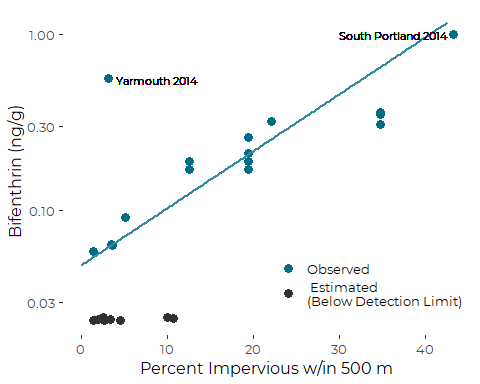
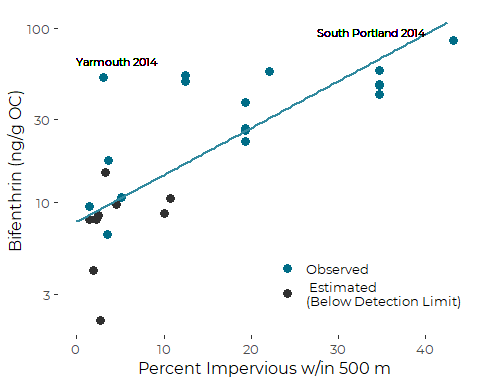

Prepare Sediment Bifenthrin Graphics
================
Curtis C. Bohlen, Casco Bay Estuary Partnership.
Revised October 13, 2020

-   [Introduction](#introduction)
-   [Load Libraries](#load-libraries)
-   [Load Data](#load-data)
    -   [Folder References](#folder-references)
    -   [Load IC Data](#load-ic-data)
    -   [Load Pyrethroid Concentration
        Data](#load-pyrethroid-concentration-data)
-   [Import IC metrics into
    conc\_data](#import-ic-metrics-into-conc_data)
-   [Principal Graphics](#principal-graphics)
    -   [Initial Graphic with Log-linear
        Model](#initial-graphic-with-log-linear-model)
    -   [Related Linear Models](#related-linear-models)
        -   [Linear Model](#linear-model)
        -   [Theil-Sen Resistent
            Regression](#theil-sen-resistent-regression)
        -   [Showing the Resistant
            Regression](#showing-the-resistant-regression)
-   [Concentrations on an Organic Carbon
    Basis](#concentrations-on-an-organic-carbon-basis)


# Introduction

In 2014 and 2015, the Maine Board of Pesticides Control collected
sediment samples from the Coast of Maine and Casco Bay, and analyzed
them for presence of selected pesticides, especially certain pyrethroid
pesticides.

The only pyrethroid that was observed consistently was bifenthrin,
probably because bifenthrin could be detected in sediment samples at
substantially lower concentrations than the other pyrethroid pesticides
on the testing panel.

We focus our analysis on bifenthrin. Our principal goal is to produce a
MAP of average bifenthrin concentrations and a FIGURE showing the
relationship between bifenthrin concentration and extent of nearby
impervious surfaces (as a rough measure of urbanization).

# Load Libraries

``` r
library(tidyverse)
```

    ## Warning: package 'tidyverse' was built under R version 4.0.5

    ## -- Attaching packages --------------------------------------- tidyverse 1.3.1 --

    ## v ggplot2 3.3.3     v purrr   0.3.4
    ## v tibble  3.1.2     v dplyr   1.0.6
    ## v tidyr   1.1.3     v stringr 1.4.0
    ## v readr   1.4.0     v forcats 0.5.1

    ## Warning: package 'tidyr' was built under R version 4.0.5

    ## Warning: package 'dplyr' was built under R version 4.0.5

    ## Warning: package 'forcats' was built under R version 4.0.5

    ## -- Conflicts ------------------------------------------ tidyverse_conflicts() --
    ## x dplyr::filter() masks stats::filter()
    ## x dplyr::lag()    masks stats::lag()

``` r
library(mblm)

library(CBEPgraphics)
load_cbep_fonts()

library(LCensMeans)
```

# Load Data

## Folder References

``` r
sibfldnm <- 'Derived_Data'
parent   <- dirname(getwd())
sibling  <- file.path(parent,sibfldnm)

conc_fn <- 'BPC_2014_2015_Sediment_Data.txt'
geogr_fn <- 'imperviousness.txt'
```

## Load IC Data

``` r
ic_data <- read.delim(file.path(sibling, geogr_fn), sep = ',') %>%
  select(-OBJECTID, -Latitude, -Longitude) %>%
  rename(yr = 'Year_') %>%
  mutate(pctI500 = imperv500 / (pi*500^2),
         pctI1000 = imperv1000 / (pi*1000^2),
         pctI2000 = imperv2000 / (pi*2000^2)) %>%
  filter(Location != 8)       # Remove Bothbay Location
```

## Load Pyrethroid Concentration Data

``` r
conc_data <- read.delim(file.path(sibling, conc_fn), skip = 1) %>%
  select(1:15)
```

# Import IC metrics into conc\_data

We calculate estimated organic-carbon weighted concentrations AFTER
calculating maximum likelihood estimates of dry weight. Detection limits
for the relevant methods apply to dry weight concentrations, so that is
the appropriate place to calculate the ML estimators.

``` r
ml_estimator_Raw <- sub_cmeans(conc_data$Bifenthrin_Raw,
                                               conc_data$Bifenthrin_ND)
conc_data <- conc_data %>%
  mutate(pct500   = ic_data$pctI500[match(LocCode, ic_data$Location)],
         pct1000  = ic_data$pctI1000[match(LocCode, ic_data$Location)],
         pct2000  = ic_data$pctI2000[match(LocCode, ic_data$Location)]) %>%
  mutate(Bifenthrin_ML = ml_estimator_Raw,     # Raw observation (dry weight)
         Bifenthrin_OC_QML = Bifenthrin_ML * 100* (100/(100-Moisture)) / TOC) %>%
  mutate(across(starts_with('pct'), ~ round(.x * 100, 1)))
```

# Principal Graphics

## Initial Graphic with Log-linear Model

This shows observed concentration of bifenthrin (on a wet weight basis)
as a function of how much imperviousness is nearby. Here we use the
estimate of percent imperviousness within 500 m of the sample location.
`geom_smooth()` uses a simple linear model (implicitly on
log-transformed y values), which is strongly influenced by the outliers.
The next plot uses a more robust regression, which is probably more
suitable.

``` r
plt <- ggplot(conc_data, aes(pct500, Bifenthrin_ML)) +
  geom_point(aes(color = Bifenthrin_ND), size = 3) +
  geom_smooth(method = 'lm', color = cbep_colors()[5], se = FALSE) +
  # geom_smooth(method = 'lm', formula = y ~ log(x),
  #            color = cbep_colors()[6], se = FALSE) +
  geom_text(aes(x=4, y=0.55, label = 'Yarmouth 2014'),
            hjust = 0, size = 3) +
  geom_text(aes(x=42.5, y=0.99, label = 'South Portland 2014'),
            hjust = 1, size = 3) +
  
  theme_cbep() +
  theme(legend.position=c(0.75, 0.2)) +
  
  scale_color_manual(values = cbep_colors()[c(1,3)], name = '',
                     labels = c('Observed', ' Estimated\n(Below Detection Limit)')) +
  scale_y_log10() +
  
  ylab('Bifenthrin (ng/g)') +
  xlab('Percent Impervious w/in 500 m')
plt
```

    ## `geom_smooth()` using formula 'y ~ x'

    ## Warning: Removed 4 rows containing non-finite values (stat_smooth).

    ## Warning: Removed 4 rows containing missing values (geom_point).

<!-- -->

``` r
#ggsave('BifenthrinWW.png', type = 'cairo', width = 7, height = 5)
ggsave('BifenthrinWW.pdf', device = cairo_pdf, width = 7, height = 5)
```

    ## `geom_smooth()` using formula 'y ~ x'

    ## Warning: Removed 4 rows containing non-finite values (stat_smooth).

    ## Warning: Removed 4 rows containing missing values (geom_point).

## Related Linear Models

`geom_smooth()` implies a linear model, and we should examine whether it
provides a robust analysis or not. Here we compare a linear model with a
Theil-Sen slope estimate, which is far more resistant to outliers. Slope
and intercept estimates are substantially different. Plotting the
Theil-Sen line produces a line more aligned with the bulk of the data,
and so id preferred i this setting.

### Linear Model

``` r
the_lm <- lm(log10(Bifenthrin_ML)~pct500, data = conc_data)
summary(the_lm)
```

    ## 
    ## Call:
    ## lm(formula = log10(Bifenthrin_ML) ~ pct500, data = conc_data)
    ## 
    ## Residuals:
    ##      Min       1Q   Median       3Q      Max 
    ## -0.51492 -0.23495 -0.02174  0.16757  1.10260 
    ## 
    ## Coefficients:
    ##              Estimate Std. Error t value Pr(>|t|)    
    ## (Intercept) -1.454017   0.098072 -14.826 1.40e-13 ***
    ## pct500       0.032131   0.005179   6.203 2.07e-06 ***
    ## ---
    ## Signif. codes:  0 '***' 0.001 '**' 0.01 '*' 0.05 '.' 0.1 ' ' 1
    ## 
    ## Residual standard error: 0.3381 on 24 degrees of freedom
    ##   (4 observations deleted due to missingness)
    ## Multiple R-squared:  0.6159, Adjusted R-squared:  0.5999 
    ## F-statistic: 38.48 on 1 and 24 DF,  p-value: 2.07e-06

### Theil-Sen Resistent Regression

We use a resistant regression estimator, known as the Theil-Sen
estimator, implemented (*inter alia*) as `mblm()` in the mblm package.
Statistical significance for these tests can be a bit finicky in the
case of tied values, which we have here, so we resort to testing
significance of the closely related Kendall’s Tau correlation
coefficient. In a more careful analysis, we might try permutation tests,
or a bootstrap, but in this case, the results are highly significant by
any test, so there is little point in being more precise.

Unfortunately, the mblm package does not handle missing values or data
transformations all that well, so we need to clean things up a bit.

``` r
tmp <- conc_data %>%
  filter(! is.na(pct500)) %>%
  select(pct500, Bifenthrin_ND, Bifenthrin_ML, Bifenthrin_OC_QML) %>%
  mutate(log_bifenthrin  = log(Bifenthrin_ML),
         log_bifenthrin_oc = log(Bifenthrin_OC_QML))
the_mblm <- mblm(log_bifenthrin~pct500, data = tmp)
summary(the_mblm)
```

    ## Warning in wilcox.test.default(z$intercepts): cannot compute exact p-value with
    ## ties

    ## Warning in wilcox.test.default(z$slopes): cannot compute exact p-value with ties

    ## Warning in wilcox.test.default(z$intercepts): cannot compute exact p-value with
    ## ties

    ## Warning in wilcox.test.default(z$slopes): cannot compute exact p-value with ties

    ## 
    ## Call:
    ## mblm(formula = log_bifenthrin ~ pct500, dataframe = tmp)
    ## 
    ## Residuals:
    ##      Min       1Q   Median       3Q      Max 
    ## -1.52109 -0.87019 -0.40064  0.05394  2.20897 
    ## 
    ## Coefficients:
    ##             Estimate      MAD V value Pr(>|V|)    
    ## (Intercept) -3.02041  0.15766       0 8.80e-06 ***
    ## pct500       0.07472  0.01710     348 1.25e-05 ***
    ## ---
    ## Signif. codes:  0 '***' 0.001 '**' 0.01 '*' 0.05 '.' 0.1 ' ' 1
    ## 
    ## Residual standard error: 0.8544 on 24 degrees of freedom

``` r
cor.test(tmp$pct500,tmp$log_bifenthrin, method = 'kendall')
```

    ## Warning in cor.test.default(tmp$pct500, tmp$log_bifenthrin, method = "kendall"):
    ## Cannot compute exact p-value with ties

    ## 
    ##  Kendall's rank correlation tau
    ## 
    ## data:  tmp$pct500 and tmp$log_bifenthrin
    ## z = 4.2328, p-value = 2.308e-05
    ## alternative hypothesis: true tau is not equal to 0
    ## sample estimates:
    ##       tau 
    ## 0.6035667

We create a dataframe to pass to ggplot to generate the regression line
in our plot

``` r
coefs <- coef(the_mblm)
theline <- tibble(x = seq(0,42.5, .25),
                  y = exp(coefs[[1]] + coefs[[2]]*seq(0,42.5, .25)))
```

### Showing the Resistant Regression

``` r
plt <- ggplot(tmp, aes(pct500, Bifenthrin_ML)) +
  geom_point(aes(color = Bifenthrin_ND), size = 3) +
  geom_line(data = theline, aes(x,y),
            color = cbep_colors()[5],
            lwd = 1) +
  geom_text(aes(x=4, y=0.55, label = 'Yarmouth 2014'),
            hjust = 0, size = 3) +
  geom_text(aes(x=42.5, y=0.99, label = 'South Portland 2014'),
            hjust = 1, size = 3) +
  
  theme_cbep() +
  theme(legend.position=c(0.75, 0.2)) +
  
  scale_color_manual(values = cbep_colors()[c(1,3)], name = '',
                     labels = c('Observed', ' Estimated\n(Below Detection Limit)')) +
  scale_y_log10() +
  
  ylab('Bifenthrin (ng/g)') +
  xlab('Percent Impervious w/in 500 m')
plt
```

<!-- -->

``` r
#ggsave('BifenthrinWW_Resistant.png', type = 'cairo', width = 7, height = 5)
ggsave('BifenthrinWW_resistant.pdf', device = cairo_pdf, width = 7, height = 5)
```

# Concentrations on an Organic Carbon Basis

Toxicity of organic contaminants in sediment are often more highly
correlated concentrations as a fraction of the organic carbon in the
sample, rather than the mass fraction in the entire sample. Maine BEP
toxicologist, Pam Breyer, used OC-based concentrations to evaluate
whether levels of bifenthrin approached levels of concern, and concluded
that they did not.

In our context, looking at spatial patterns, rather than toxicity, it is
not obvious which concentration basis makes better sense. Here we
produce the OC-based graphic, for completeness, although we are unlikely
to use it in the Report.

``` r
the_mblm <- mblm(log_bifenthrin_oc~pct500, data = tmp)
summary(the_mblm)
```

    ## 
    ## Call:
    ## mblm(formula = log_bifenthrin_oc ~ pct500, dataframe = tmp)
    ## 
    ## Residuals:
    ##      Min       1Q   Median       3Q      Max 
    ## -1.48454 -0.29097 -0.06823  0.33060  1.71681 
    ## 
    ## Coefficients:
    ##             Estimate     MAD V value Pr(>|V|)    
    ## (Intercept)  2.05783 0.16835     351 2.98e-08 ***
    ## pct500       0.06026 0.01432     350 5.96e-08 ***
    ## ---
    ## Signif. codes:  0 '***' 0.001 '**' 0.01 '*' 0.05 '.' 0.1 ' ' 1
    ## 
    ## Residual standard error: 0.6576 on 24 degrees of freedom

``` r
cor.test(tmp$pct500,tmp$log_bifenthrin_oc, method = 'kendall')
```

    ## Warning in cor.test.default(tmp$pct500, tmp$log_bifenthrin_oc, method =
    ## "kendall"): Cannot compute exact p-value with ties

    ## 
    ##  Kendall's rank correlation tau
    ## 
    ## data:  tmp$pct500 and tmp$log_bifenthrin_oc
    ## z = 4.2741, p-value = 1.919e-05
    ## alternative hypothesis: true tau is not equal to 0
    ## sample estimates:
    ##       tau 
    ## 0.6070653

We again create a dataframe.

``` r
coefs <- coef(the_mblm)
theline <- tibble(x = seq(0,42.5, .25),
                  y = exp(coefs[[1]] + coefs[[2]]*seq(0,42.5, .25)))
```

``` r
plt <- ggplot(conc_data, aes(pct500, Bifenthrin_OC_QML)) +
  geom_point(aes(color = Bifenthrin_ND), size = 3) +
  geom_line(data = theline, aes(x,y),
            color = cbep_colors()[5],
            lwd = 1) +
  geom_text(aes(x=4, y=53, label = 'Yarmouth 2014'),
            hjust = 0, size = 3) +
  #geom_text(aes(x=42.5, y=86, label = 'South Portland 2014'),
  #          hjust = 1, size = 3) +
  
  theme_cbep() +
  theme(legend.position=c(0.75, 0.2)) +
  
  scale_color_manual(values = cbep_colors()[c(1,3)], name = '',
                     labels = c('Observed', ' Estimated\n(Below Detection Limit)')) +
  scale_y_log10() +
  
  ylab('Bifenthrin (ng/g OC)') +
  xlab('Percent Impervious w/in 500 m')
plt
```

    ## Warning: Removed 4 rows containing missing values (geom_point).

<!-- -->

``` r
#ggsave('BifenthrinOC_Resistant.png', type = 'cairo', width = 7, height = 5)
ggsave('BifenthrinOC_resistant.pdf', device = cairo_pdf, width = 7, height = 5)
```

    ## Warning: Removed 4 rows containing missing values (geom_point).
